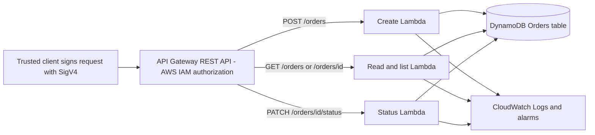

# Request flow

```mermaid
flowchart LR
  C[Trusted client signs request with SigV4] --> A[API Gateway REST API - AWS IAM authorization]
  A -->|POST /orders| L1[Create Lambda]
  A -->|GET /orders or /orders/id| L2[Read and list Lambda]
  A -->|PATCH /orders/id/status| L3[Status Lambda]
  L1 --> D[(DynamoDB Orders table)]
  L2 --> D
  L3 --> D
  L1 --> CW[CloudWatch Logs and alarms]
  L2 --> CW
  L3 --> CW
```

The caller has API invocation permission only. Each Lambda assumes its own execution role to access DynamoDB. No client receives database credentials or network access to DynamoDB.
