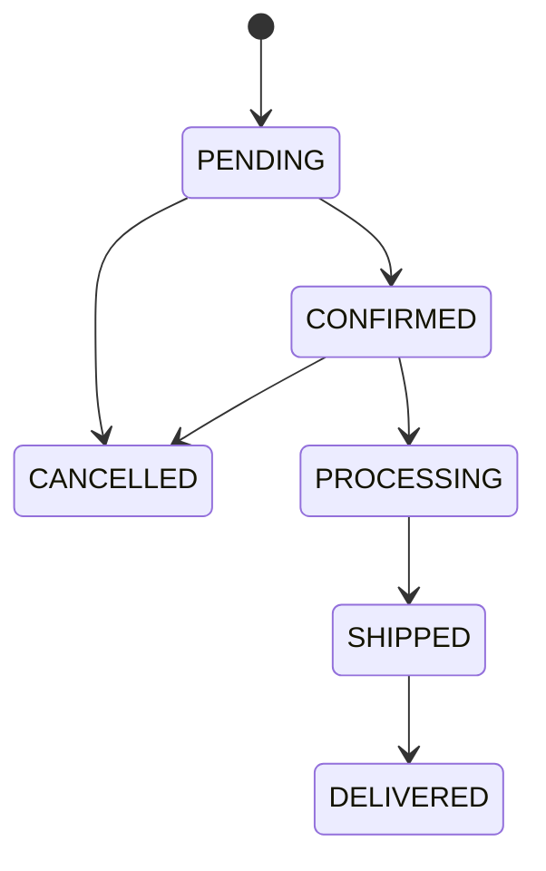

# Order state machine

```mermaid
stateDiagram-v2
  [*] --> PENDING
  PENDING --> CONFIRMED
  PENDING --> CANCELLED
  CONFIRMED --> PROCESSING
  CONFIRMED --> CANCELLED
  PROCESSING --> SHIPPED
  SHIPPED --> DELIVERED
```

`DELIVERED` and `CANCELLED` are terminal states. Invalid edges are rejected before persistence. See `transition-rules.md` for the explicit transition list.
